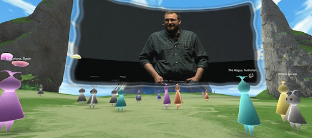
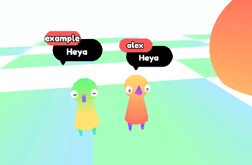
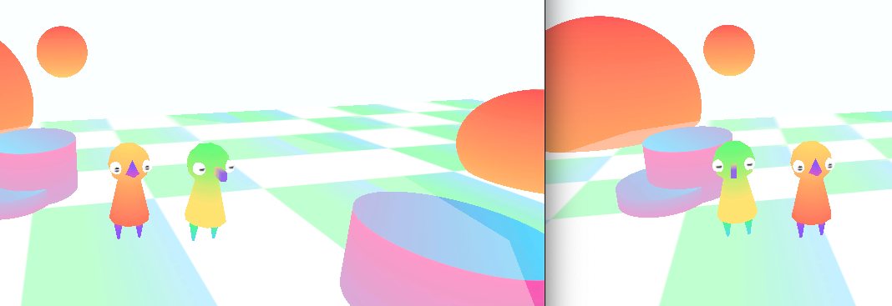

#  🎪 amìco
a open-source virtual summit program

## Planned features
- a peep(the characters)
- self desctructive chat
- emoji reactions (kinda like animal crossing)
- sound management for videos in game
- floating dashjs videos from youtube

## peeps
there are a few other project focused on random characters
I think peep can also be similar to [Gridy](https://github.com/darosh/gridy-avatars) or [Give me avatar](https://github.com/ClydeDz/give-me-an-avatar-npm)

# Inspirations

I saw a virtual summit this year and while it and i love animal crossing so i wanted to make a simple virtual space for everyone.

## Why not VR
people dont have the hardware and its not simple yet
maybe when its common but I think its better to target more devices, 
older devices then VR and high end devices.

# Rewrite from Godot
currently godot doesnt support any sort of html embeding like dash videos or hsl videos so i had to rewrite it in a more web friendly setup.

